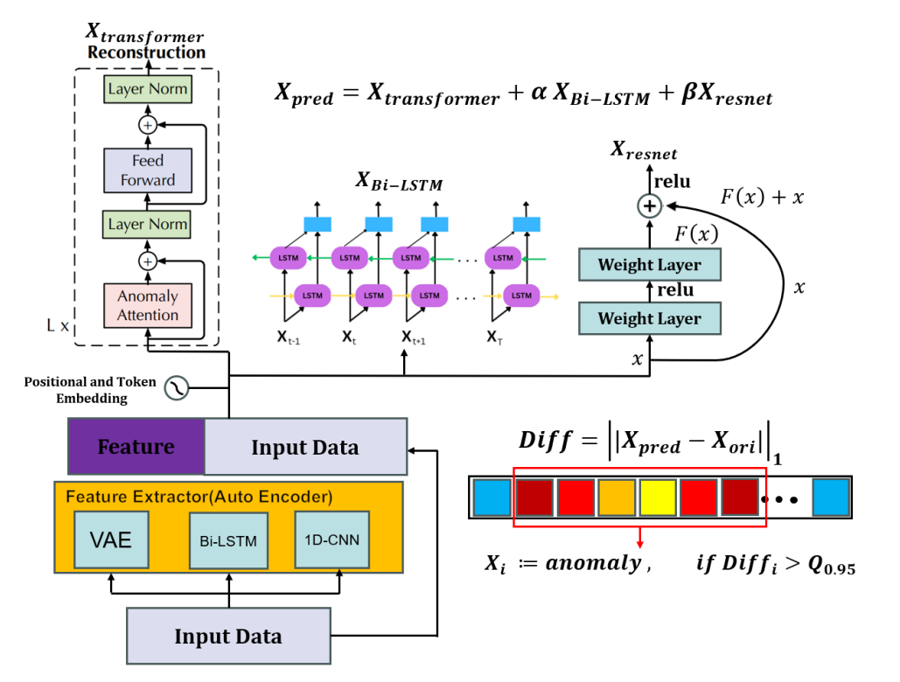

# Anomaly-TransformerX: Multi-Feature Fusion Ensemble with Performance-based Voting

## Overview
This repository contains the implementation and details of our project **Anomaly-TransformerX**, developed as part of the **COMP4434 Big Data Analytics Project**. Our work focuses on enhancing anomaly detection in time series data by addressing limitations in existing methodologies, particularly the Anomaly Transformer model. 

## Introduction

Deep learning has significantly advanced anomaly detection, providing automatic feature learning and improved accuracy. In this project, we propose **Anomaly-TransformerX** to address the limitations of the existing **Anomaly Transformer** model. 

Key improvements include:
- Enhanced feature engineering.
- Better optimization of dual-branch attention mechanisms.
- Multi-feature fusion and ensemble learning for robust anomaly detection.

---

## Key Contributions
The main contributions of **Anomaly-TransformerX** are:
1. **Architecture Simplification & Adaptation**:
   - Added an MLP layer in the Transformer encoder for flexible modeling of non-stationary data distributions.
   
2. **Residual Learning via Hybrid Networks**:
   - Introduced a dual-branch residual fitting module combining:
     - **Bi-LSTM** for temporal dynamics.
     - **Tiny-ResNet** for local feature extraction.

3. **Multi-Feature Fusion with Cross-Domain Attention**:
   - Leveraged:
     - **VAE encoder**.
     - **1D CNN encoder**.
     - **LSTM hidden layers** for comprehensive time-series feature extraction.

4. **Multi-Model Ensemble with Performance-based Voting**:
   - Implemented a weighted voting mechanism integrating predictions from **Anomaly-TransformerX** and other machine learning models for robust outputs.

---

## Architecture Overview
### Limitations of the Anomaly Transformer:
- Lack of a feature engineering module.
- Optimization challenges in balancing reconstruction error and KL divergence in dual-branch attention.

### Proposed Enhancements:
1. **Transformer Enhancements**:
   - Simplified architecture with an MLP layer.
   
2. **Hybrid Networks**:
   - Combined Bi-LSTM and Tiny-ResNet for multi-scale anomaly detection.

3. **Feature Fusion**:
   - Integrated VAE, 1D CNN, and LSTM for cross-domain attention.

4. **Voting Mechanism**:
   - Applied performance-based ensemble learning for robust anomaly detection.

